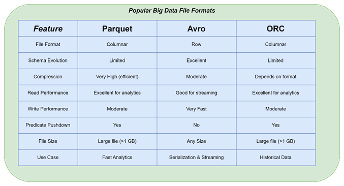

# BigDataQnA
## Spark Question and Answer
1. Difference between RDD & Dataframes

=> RDD → Raw power, full control, but slower!
=> DataFrame → Optimized, easy, SQL-friendly!
=>Dataset → Strongly typed, safer, but JVM-only!

2. What are the challenges you face in spark?

    Data Skew → Uneven data distribution causes slow tasks and performance bottlenecks.
    Memory Management → OutOfMemory errors if not tuned properly (executors, caching, shuffle).
    Shuffle Overhead → Expensive operations like joins, groupBy lead to excessive disk and network I/O.

    Small Files Problem → Too many small files increase job planning and file listing overhead.
    Job Debugging → Complex DAG and multiple stages make debugging non-trivial.
    Serialization Issues → Inefficient or incompatible serialization can degrade performance.
    Schema Evolution → Changes in schema may lead to runtime errors in Parquet or Delta files.
    Slow UDFs → Spark UDFs (especially Python) are slower and not optimized by Catalyst.
    
3. What is difference between reduceByKey & groupByKey?

    Both reduceByKey and groupByKey are used for aggregating key-value pair RDDs in Spark. However, reduceByKey is more efficient than groupByKey because it reduces data before shuffling.

4. What is the difference between Persist and Cache?
   
   Cache is in-memory storage and persist might be in-memory or disk only or memory and disk only.

5. What is the Advantage of a Parquet File?
    
    
    Fast Reads + Small Size + Schema-aware + Analytics-friendly

6. What is a Broadcast Join ?

    A Broadcast Join is a performance-optimized join in Spark where a small DataFrame is sent (broadcasted) to all worker nodes, avoiding expensive shuffles.

7. What is Difference between Coalesce and Repartition?

    Both helps to change the partition size. **Coalesce** helps to decrease the partition size within the node without shuffling the data. **Repartition** helps to do both increase and decrease partition size but it shuffles the data between nodes to maintain equal          partition size.
 
8. What are the roles and responsibility of driver in spark Architecture?

    The Driver is the master process in Spark architecture that coordinates the entire application execution. Key responsibilities are Job submission, DAG creation, Task scheduling, Cluster Communication, Broadcasting variables, Tracking Execution, Collecting result.

    In short, The Driver is the brain of a Spark application. It builds the execution plan, talks to the cluster manager, and coordinates with executors to run tasks.

9. What is meant by Data Skewness? How is it deal? 

    If one executor get the lot of load in a work node after the shuffling, it is called data skewness. It can be solved by spark salting.
    

10. What are the optimisation techniques used in Spark?

    Predicate Pushdown, Column Pruning, Broadcast Join, Partitioning & Bucketing, Caching & Persistence, Coalesce vs. Repartition, Use Efficient File Formats, Avoid Wide Transformations, Memory Tuning, Avoid Collect() on Large Datasets, Skewed Join Handling, Use             DataFrame API Instead of RDD

11. What is Difference Between Map and FlatMap?
12. What are accumulator and BroadCast Variables?
13. What is a OOM Issue, how to deal it?
14. what are tranformation in spark? Type of Transformation?
15. Tell me some action in spark that you used ?
16. What is the role of Catalyst Optimizer ?
17. what is the checkpointing?
18. Cache and persist
19. What do you understand by Lazy Evaluation ?
20. How to convert Rdd to Dataframe?
21. How to Dataframe to Dataset.
22. What makes Spark better than Mapreduce?
23. How can you read a CSV file without using an external schema?
24. What is the difference between Narrow Transformation and Wide Transformation?
25. What are the different parameters that can be passed while Spark-submit?
26. What are Global Temp View and Temp View?
27. How can you add two new columns to a Data frame with some calculated values?
28. Avro Vs ORC, which one do you prefer?
29. What are the different types of joins in Spark?
30. Can you explain Anti join and Semi join?
31. What is the difference between Order By, Sort By, and Cluster By?
32. Data Frame vs Dataset in spark?
33. 4.What are the join strategies in Spark
34. What happens in Cluster deployment mode and Client deployment mode
35. What are the parameters you have used in spark-submit
36. How do you add a new column in Spark
37. How do you drop a column in Spark
38. What is difference between map and flatmap?
39. What is skew partitions?
40. What is DAG and Lineage in Spark?
41. What is the difference between RDD and Dataframe?
42. Where we can find the spark application logs.
43. What is the difference between reduceByKey and groupByKey?
44. what is spark optimization?
45. What are shared variables in spark
46. What is a broadcast variable
47. Why spark instead of Hive
48. what is cache
49. Tell me the steps to read a file in spark
50. How do you handle 10 GB file in spark, how do you optimize it?
